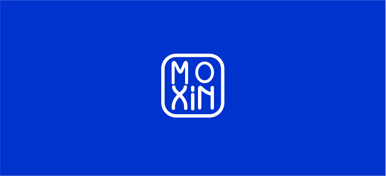

# Moxin Organization

The Moxin Organization is an open community for discovery and exploration of AI LLMs. It is a welcoming, public space to gather and discover projects and resources related to LLMs, Agents, and other AI related topics.

## Projects

* [Moxin LLM](https://github.com/moxin-org/Moxin-LLM) - a family of high-performance, truly open, and fully reproducible LLMs that excels in zero-shot tasks and efficient operation on edge devices.
* [Moxin VLM](https://github.com/moxin-org/Moxin-VLM) - built upon the Moxin-LLM backbone, a VLM designed for advanced vision-language understanding and interaction.
* [Moly](https://github.com/moxin-org/moly) - a cross-platform AI model chat application which works with local & cloud models, built in Rust using [Makepad](https://github.com/makepad) Framework and [Project Robius](https://github.com/project-robius) platform tools.
* [MoFA](https://github.com/moxin-org/mofa) - a software framework for building AI agents through a composition-based approach. Using MoFA, AI agents can be constructed via templates and combined in layers to form more powerful Super Agents.

## Presentations
[Moxin LLM](https://github.com/moxin-org/moly): 
* [GOSIM AI Paris 2025](https://paris2025.gosim.org): Towards Fully Open-Source LLM from Pre-training to Reinforcement Learning [[Youtube]](https://www.youtube.com/watch?v=G5AGsGTYkZA)

[Moly](https://github.com/moxin-org/moly) (previously named Moxin): 
* [GOSIM Europe 2024](https://europe2024.gosim.org/schedule#ai): A Pure Rust Explorer for Open Source LLMs [[Youtube]](https://www.youtube.com/watch?v=pwbL7IERPz4) [[Slides]](https://github.com/gosimfoundation/europe2024/blob/main/presentations/ai-agents/Jorge_Bejar-GOSIM%202024-Moxin.pdf)
  

## Contributing

We welcome contributions, ideas, and suggestions from anyone! We're also open to help you host and maintain your project under the umbrella of the Robius organization.

Translations of book content and READMEs to other languages are especially appreciated! If you speak multiple languages and are feeling generous, kindly reach out to us.
